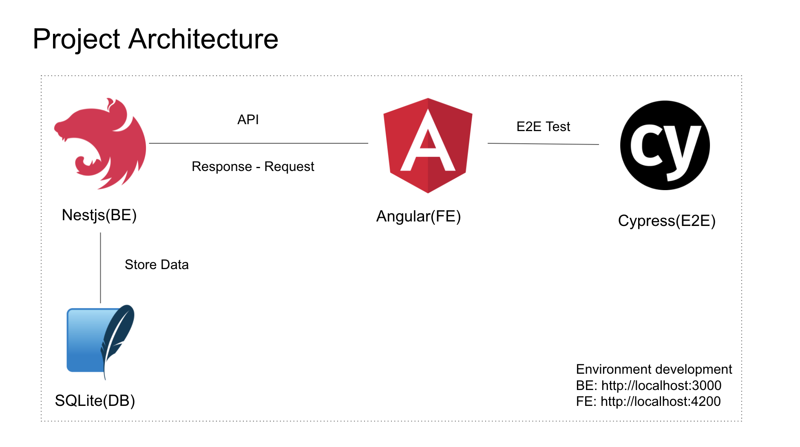

### TodoList
1. <del>Create api crud for company and user (nest - done)</del>
2. <del>Create api for upload and preview image (nest - done)</del>
3. <del>Consume api (angular - done)</del>
4. <del>Create ui (angular - done)</del>
5. Create testing e2e for crud on user and company (angular - on going)
6. <del>Create auth for login and signup on be (nest - done)</del>

### Feature FE that we need to test
1. Menu User: create, update, delete, view detail, upload image, view image
2. Menu Company: create, update, delete, view detail.

### How To Use
1. Clone this project
2. Open project -> cd be -> npm install -> npm run start:dev
3. From the repository be -> cd ../fe -> npm install -> npm run start:dev
4. Test on localhost:4200

### Architecture

